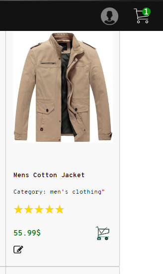
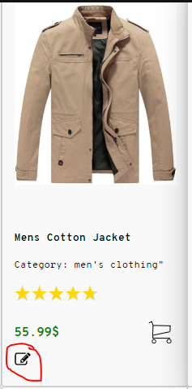
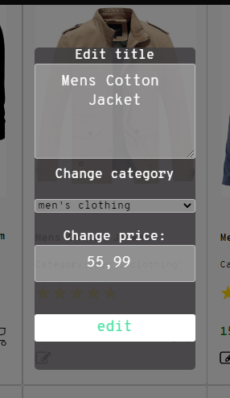

## E-store(task-2)

<a href="https://socet.netlify.app/" target="blank">

</a>

Try the App: [socet.netlify.app](https://socet.netlify.app/)

##How it works

-  **Geting data from https://fakestoreapi.com**
-  **You can sort products(delay 1sec.)**
-  **Add item to the cart, and you can see amount in cart**
 -
- **You can edit product title, category and price. Click edit button, and after 1sec you will see curent state**
 -
 -

 - **Interaction with website build on class methods**
## 🛠️ Installation Steps
1. Downoload ZIP
2. In folder Public, open index.html with Live Server
  ```
  public/index.html
  ```
